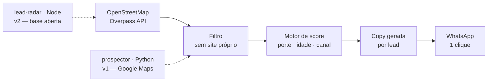

## Eduardo Grunitzky

Analista de **RPA**. Meu trabalho é pegar um processo que alguém repete na mão toda
semana e devolver ele rodando sozinho.

Fora do expediente eu construo ferramentas de prospecção — porque o processo comercial
acabou sendo o mais manual de todos que eu encontrei.

<a href="https://www.linkedin.com/in/eduardo-grunitzky-65400b1b1/">LinkedIn</a> ·
<a href="mailto:eduardogrunitzky@gmail.com">eduardogrunitzky@gmail.com</a>

---

## O pipeline que eu construí

Não são projetos soltos: é uma esteira comercial inteira, montada em duas linguagens
ao longo de duas iterações.

### [lead-radar](https://github.com/DUZINz/lead-radar) · JavaScript

Plataforma de mineração e qualificação de leads B2B. Base 100% real via OpenStreetMap,
motor de scoring próprio e copy de abordagem gerada por lead.

**A decisão que importa:** roda em dois ambientes com um único `server.mjs` — SQLite local,
serverless na Vercel — sem `if` espalhado pelo código. O ambiente é detectado uma vez e a
camada de persistência é trocada; em serverless o `import` de `node:sqlite` simplesmente
nunca acontece e o estado passa a viver no navegador.

**Zero dependências.** 748 linhas, só `node:http` e `node:sqlite` da stdlib. Sem build step.

### [prospector](https://github.com/DUZINz/prospector) · Python

A v1 da mesma tese: acha negócio que **não tem site** — o lead ideal pra quem vende
presença digital. Google Maps como fonte, saída com telefone, WhatsApp e nota.

### [finrisk-processor](https://github.com/DUZINz/finrisk-processor) · Java

Avaliação de risco financeiro em arquitetura modular. **Chain of Responsibility** para
validações encadeadas, **Strategy** para trocar o algoritmo de risco em runtime, modelos
imutáveis e orquestração isolada em serviço.

### [dashboard_data](https://github.com/DUZINz/dashboard_data) · Python

Upload de Excel/CSV → processamento → dashboard. O caminho curto entre planilha e decisão.

---

## Como eu trabalho

**Dependência é dívida.** Se dá pra resolver com a stdlib, resolve com a stdlib. O
lead-radar inteiro não tem um `node_modules` porque não precisou ter.

**Automação sem medição é fé.** Bot que roda mas ninguém sabe quanto tempo economizou é
bot que vai ser desligado no primeiro incidente.

**O código difícil não é o que funciona.** É o que continua funcionando quando o site muda
o HTML, a API muda o schema e o servidor cai no meio da execução.

---

## Stack

**Diário** — Python, Java  
**Construindo com** — Node.js, PostgreSQL, MySQL, Docker, Git, Linux  
**Estudando** — Data Science, arquitetura de software
