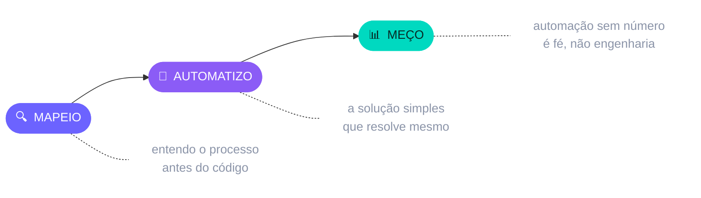

  

 

<table>
<tr>
<td width="33%" align="center">

### 🎓
**Formação**

`⚠️ PREENCHER`

**Curso**
Instituição · ano

</td>
<td width="33%" align="center">

### 💼
**No que trabalho**

Automação de
Processos — **RPA**

</td>
<td width="33%" align="center">

### 🎯
**O que entrego**

Tarefa manual virando
rotina que roda sozinha

</td>
</tr>
</table>

 

### 🧰 Com o que eu construo

 

 

  

### ⚙️ Como uma automação minha nasce

 

## 🎮 Clica no teu problema

**quatro problemas · abre o que parece com o teu · tem um segundo nível dentro**

<b>&nbsp;💸&nbsp; "Todo mês alguém copia dados de um sistema pro outro na mão"</b>

 

|  | 🔴 Hoje | 🟢 Com bot |
|---|---|---|
| **Quem faz** | uma pessoa, manhã inteira | ninguém |
| **Erro de digitação** | acontece e ninguém vê | impossível |
| **Se falhar** | descobre no fechamento | alerta na hora |

**Esforço humano por rodada**

🟥🟥🟥🟥🟥🟥🟥🟥 &nbsp;`hoje`
🟩⬜⬜⬜⬜⬜⬜⬜ &nbsp;`com bot`

🔍 <i>ver como eu faço</i>

 

**1.** Leio a origem — banco, API, arquivo ou a própria tela
**2.** Valido cada registro antes de gravar (lixo não entra)
**3.** Gravo no destino e guardo o log linha a linha
**4.** Te mando o resumo: passou X, falhou Y, e por quê

<b>&nbsp;📄&nbsp; "Preciso do mesmo relatório toda segunda, sem falta"</b>

 

|  | 🔴 Hoje | 🟢 Com bot |
|---|---|---|
| **Quando fica pronto** | quando alguém lembra | segunda, 7h |
| **Se a fonte cair** | você descobre na reunião | você é avisado antes |
| **Formato** | refeito toda vez | idêntico sempre |

🔍 <i>ver como eu faço</i>

 

**1.** Agendo a rotina no horário que te serve
**2.** Busco o dado na fonte e trato o que vier torto
**3.** Monto o arquivo no formato que você já usa
**4.** Entrego no e-mail ou no painel — e aviso se algo travou

<b>&nbsp;🔒&nbsp; "O sistema que a gente usa não tem API"</b>

 

Sistema fechado **atrasa** a automação, não impede. Tem sempre uma porta:

| Porta | Quando uso | Estabilidade |
|---|---|---|
| 🗄️ **Banco de dados** | tenho acesso de leitura | 🟩🟩🟩 |
| 📁 **Arquivo exportado** | o sistema cospe CSV/Excel | 🟩🟩⬜ |
| 🖱️ **Interface** | não sobrou nenhuma das outras | 🟩⬜⬜ |

🔍 <i>ver como eu faço</i>

 

**1.** Testo as portas nessa ordem — da mais estável pra menos
**2.** Isolo a parte frágil num só lugar do código
**3.** Se o sistema mudar, conserto num ponto, não em vinte

<b>&nbsp;🛠️&nbsp; "O que eu preciso não existe pronto no mercado"</b>

 

Então se constrói. Back-end, API, aplicação web — no tamanho do teu problema,
não no tamanho do orçamento de uma suíte enterprise.

🔍 <i>ver como eu faço</i>

 

**1.** Entendo o processo antes de escrever a primeira linha
**2.** Entrego a menor versão que já resolve — e você usa
**3.** Cresço em cima do que provou funcionar

 

### Tem um processo que ninguém aguenta mais fazer na mão?

